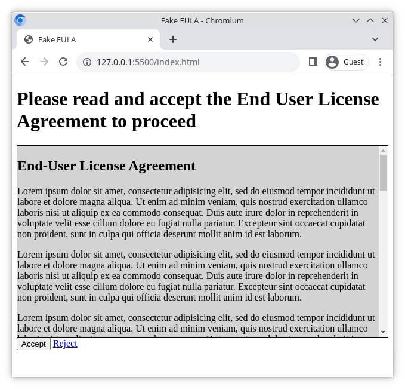

# Gefälschte EULA (Endbenutzer-Lizenzvereinbarung)

Mit dieser Übung kannst du die Verwendung der CSS-Eigenschaft `overflow` üben.

## Was du machen wirst

Du wirst eine Seite erstellen, die einem Benutzer während des Registrierungsprozesses angezeigt wird. Die Seite enthält eine EULA (Endbenutzer-Lizenzvereinbarung), die der Benutzer genehmigen muss, um mit der Registrierung fortzufahren. Dir werden die benötigten Dateien und eine grundlegende Struktur zur Verfügung gestellt.

### Beispiel

## Aufgaben

### Aufgabe 1

- Öffne `index.html` mit der VS Code Live Server Erweiterung
- Füge eine Überschrift auf oberster Ebene mit dem Text **Bitte lies und akzeptiere die Endbenutzer-Lizenzvereinbarung, um fortzufahren** hinzu

### Aufgabe 2

- Füge am unteren Rand der Seite einen **Akzeptieren**-Button hinzu
- Füge einen **Ablehnen**-Link hinzu, der den Benutzer zu [https://example.org](https://example.org) weiterleitet

### Aufgabe 3

- Füge in `style.css` Styling hinzu, um die Seite so nah wie möglich an den Beispiel-Screenshot anzupassen
- In dem Beispiel ist die Höhe des grauen EULA-Kastens `20em`

### Aufgabe 4

Im Beispielbild enthält der graue EULA-Kasten eine vertikale Bildlaufleiste.

- Verwende die CSS-Eigenschaft `overflow`, um die vertikale Bildlaufleiste sichtbar zu machen.

#### Hinweise

- [MDN: CSS overflow](https://developer.mozilla.org/en-US/docs/Web/CSS/overflow)
